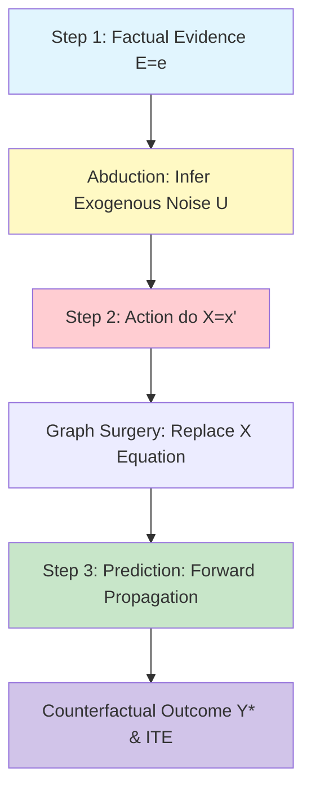

# GenPark Counterfactual Three-Step Abduction Prediction Skill

Pearl's 3-step counterfactual inference engine executing Abduction, Action, and Prediction.

Find more agent capabilities at [GenPark](https://genpark.ai) and the [GenPark MCP Catalog](https://genpark.ai/mcp).

## Features
- Pure Python implementation of Pearl's three-step counterfactual ladder.
- Individual Treatment Effect (ITE) calculation for individual units.
- Zero external dependencies.
